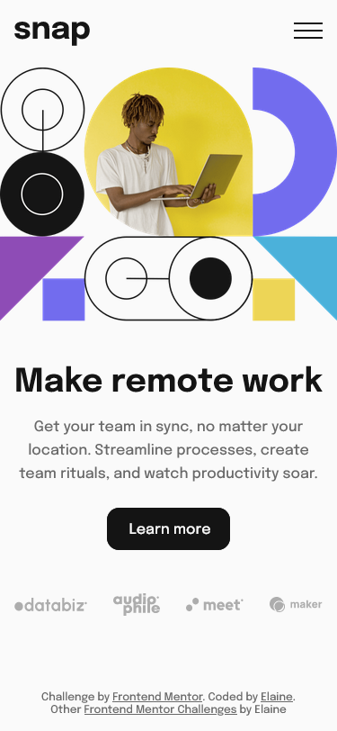
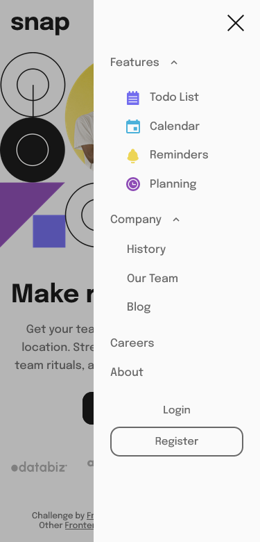
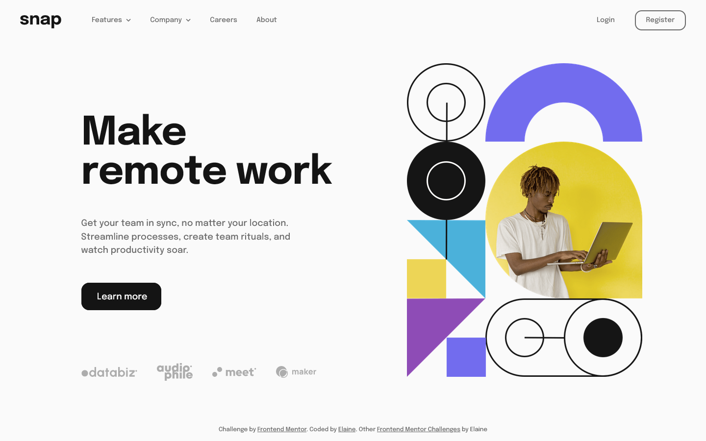

# Frontend Mentor - Intro section with dropdown navigation solution

This is a solution to the [Intro section with dropdown navigation challenge on Frontend Mentor](https://www.frontendmentor.io/challenges/intro-section-with-dropdown-navigation-ryaPetHE5). Frontend Mentor challenges help you improve your coding skills by building realistic projects. 

## Table of contents

- [Overview](#overview)
  - [The challenge](#the-challenge)
  - [Screenshot](#screenshot)
  - [Links](#links)
- [My process](#my-process)
  - [Built with](#built-with)
  - [What I learned](#what-i-learned)
  - [Continued development](#continued-development)
  - [Useful resources](#useful-resources)
- [Author](#author)

## Overview

### The challenge

Users should be able to:

- View the relevant dropdown menus on desktop and mobile when interacting with the navigation links
- View the optimal layout for the content depending on their device's screen size
- See hover states for all interactive elements on the page

### Screenshot

### Links

- Solution URL: [Link to GitHub repo](https://github.com/elaineleung/fem-introsecdropdownnav)
- Live Site URL: [Link to live site](https://fem-introsecdropdownnav.vercel.app/)
- Main Frontend Mentor repository: [Link to FEM repo](https://github.com/elaineleung/frontendmentor)

## My process

### Built with

- Semantic HTML5 markup
- CSS custom properties
- Flexbox
- CSS Grid
- Mobile-first workflow
- ViteJS
- SCSS
- React

### What I learned

I decided to use this project to brush up on React, which I haven't used in a while since I started using Next JS, and even though Next Js takes React as its core, there are a number of things that are done somewhat differently (as in prescriptively). Thankfully, I actually started in React when I first started learning web development, which was quite a dive into the deep end for a newbie, but thankfully I made it out alive and I think a lot of the skills I learned then helped me out a lot in learning JS as well.

In the beginning I actually started building this with just HTML, SCSS, and JS, but very quickly I realized that I might want to try using React, as I anticipated I might need some advanced state handling, plus I might want to develop this more later. I also ended up checking out Vite since I had seen someone else use it and had wanted to learn more about it, and true to its name, it is a very fast tool to use. For quickly putting a React project together, Vite definitely is a great choice, and I will for sure be using it more in the future.

I'm using CUBE CSS with this project as well, and even though I'm still quite reliant on BEM, I find myself slowly adopting CUBE CSS practices, such as the use of utilities. I also tried to make sure that there's optimal viewing no matter the size of the client. There was an instance or two of `clamp()`, and `max-width` also came in handy; it just took some to experiment since I don't know the sizes beforehand (which to me is part of the challenge). 

Here's a short list of things I relearned/newly learned:
- How to detect window width in React
- Handling SVGs in React
- Dropdown navbars 
- Overlay with slide-in mobile menu
- Using `srcset` in ``. I used this in a `<picture>` element in another project, but this time I decided try something a bit different, and it worked quite well
- Making sure footer is stretched to the bottom. I usually use flexbox on my plain JS projects, and I forgot that React needs something different.

### Continued development

I'd want to add React Router later when I have time so that this can be a somewhat functional app.

### Useful resources

- [Responsive switching](https://developer.mozilla.org/en-US/docs/Learn/HTML/Multimedia_and_embedding/Responsive_images) - How to use `srcset` and `sizes` in images. 
- [How to build an accessiible toggle button](https://joshcollinsworth.com/blog/accessible-toggle-buttons) - I was looking at this when I wanted to see how to build a button to open the menu.
- [How to import SVGs in React and Vite](https://www.freecodecamp.org/news/how-to-import-svgs-in-react-and-vite/) - This helped me when I needed to find a way to change properties on my SVGs (such as color change on hover)

## Author

- Frontend Mentor - [@elaineleung](https://www.frontendmentor.io/profile/elaineleung)
- Twitter - [@elaineclleung](https://twitter.com/elaineclleung)
